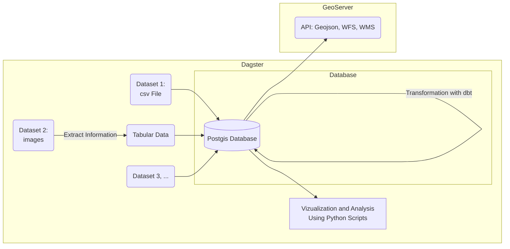

# Concepts

## Modules
The codebase of `open-dapro` builds upon several open-source frameworks: 
  
  * [Dagster](https://dagster.io/){:target="_blank"} is a data pipelining tool. You can use it to define workflows based on python scripts and schedule their execution.
  * [dbt](https://docs.getdbt.com/){:target="_blank"} is a data transformation and testing tool. You can build modular sql-based data transformations and build data unit tests.
  * [PostGIS](https://postgis.net/){:target="_blank"} is an extension of PostgreSQL to handle geodata. It is used to save raw and transformed data sets.
  * [GeoServer](https://geoserver.org/){:target="_blank"} is a tool to host [OGC-conform APIs](https://ogcapi.ogc.org/){:target="_blank"} based on a Postgis database. 

All of those tools have their own documentation pages. Make sure that you have a rough idea of their functionalities by checking their documentation pages.

