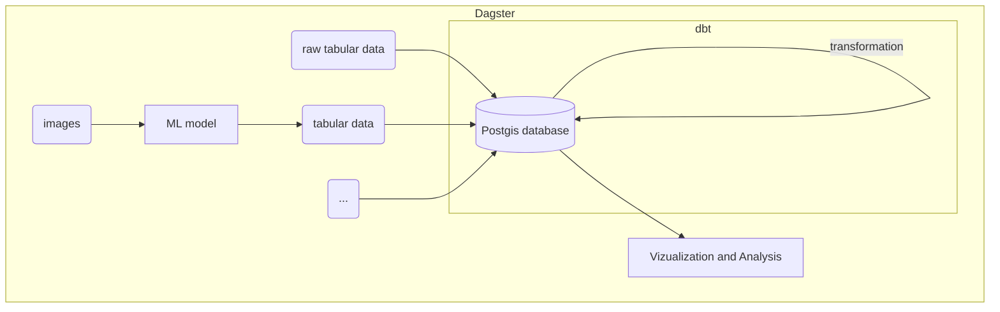

# Dagster and dbt
This project builds upon two open-source frameworks: [Dagster](https://dagster.io/) and [dbt](https://docs.getdbt.com/). We use the data orchestration tool `Dagster` to build and schedule our pipelines. Inside `Dagster`, many of the actual data transformations are implemented using `dbt`.
Both frameworks are documented extensively. Before you dive into `energy-dagster`, make sure that you have a basic understanding of the two frameworks.

!!! tip

    If you understand how to use Dagster and dbt, you will also understand `energy-dagster`.

We use `Dagster` to:

  * **Implement** the code to download raw data
  * **Save data** to databases or files 
  * **Schedule** pipeline executions

We use `dbt` to:

  * **Transform and merge** data to obtain final output tables

